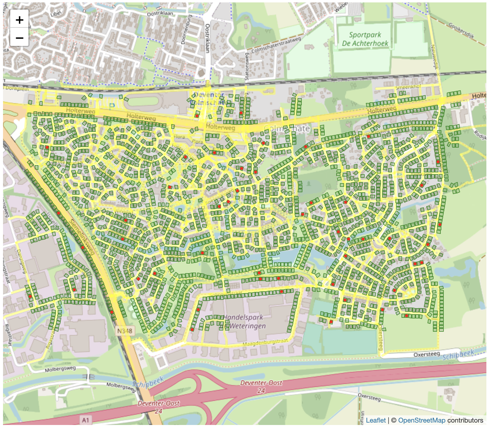

# Buur en Zo

## Probleembeschrijving

#### *Uitgangspunten*

- Er is een gegeven omgeving (buurt)
- Op een bepaald moment (dag) is er een bepaalde vraag naar dienstverlening (uitgedrukt in aantal klanten, aandacht, tijd, locaties, kwaliteit, handelingen)
- Op een bepaald moment (dag) is er een gegeven capaciteit waarmee de dienstverlening kan worden verleend (uitgedrukt in aantal conciërges, beschikbaarheid)
- ......

#### *Onderzoeksvragen*

1. Wat is bij een gegeven vraag de optimale route?
2. Welke effecten hebben varianties in vraag op de dienstverlening?
3. Welke effecten hebben schokken in de vraag op de dienstverlening?
4. ......

#### *Subvragen*

1. Hoe kan vraag worden gedefinieerd en gekwantificeerd?
2. Hoe kan capaciteit worden gedefinieerd en gekwantificeerd?
3. Hoe kan vraag worden gemeten?
4. Hoe kan capaciteit worden gemeten?
5. Welke analysemethode deterministisch of stochastisch of combinatie (volgorde)?
6. ......

----
## Links
- Buur en Zo [webpagina](buurenzo.nl)
